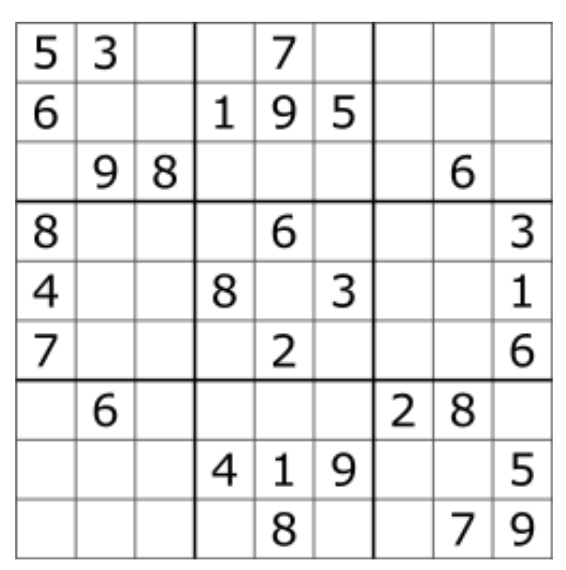
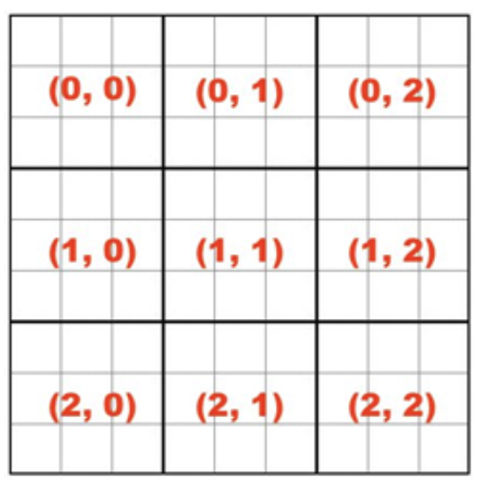

# Introduction

In this programming assignment you are asked to write an implementation for a Sudoku solver using the Scala programming language.  Wikipedia has [this](https://en.wikipedia.org/wiki/Sudoku) article that explains the rules of the game if you never played Sudoku.  The solution for this problem is going to be built in incremental steps to help your practice functional programming.  The pictures below shows a typical Sudoku board and and its boxes (including a suggested numbering). 

A Sudoku Board (source: Wikipedia) 

Sudoku Boxes (w/ identifications) 

